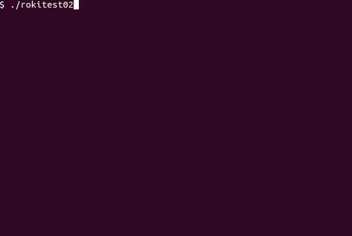

roki_test
====

Requirement
----
    
    $ sudo apt-get install build-essential
    
    $ wget http://www.mi.ams.eng.osaka-u.ac.jp/software/cure-1.0.0-beta5.tgz
    $ tar xvfz cure-1.0.0-beta5.tgz
    $ cd cure-1.0.0-beta5
    $ cp config.org config
    $ vi config
    
        PREFIX=$(HOME)/usr -> PREFIX=/usr/local
    
    $ sudo make 
    $ sudo make install
    $ sudo ldconfig
    
    $ wget http://www.mi.ams.eng.osaka-u.ac.jp/software/zm-1.0.0.tgz
    $ tar xvfz zm-1.0.0.tgz 
    $ cd zm-1.0.0/
    $ vi config
    
        PREFIX=$(HOME)/usr -> PREFIX=/usr/local
    
    $ make
    $ sudo make install
    $ sudo ldconfig
    
    $ wget http://www.mi.ams.eng.osaka-u.ac.jp/software/zeo-1.0.1.tgz
    $ tar xvfz zeo-1.0.1.tgz 
    $ cd zeo-1.0.1/
    $ vi config.org
    
        PREFIX=$(HOME)/usr -> PREFIX=/usr/local
    
    $ make
    $ sudo make install
    $ sudo ldconfig
    
    $ wget http://www.mi.ams.eng.osaka-u.ac.jp/software/roki-1.0.0.tgz
    $ tar xvfz roki-1.0.0.tgz 
    $ cd roki-1.0.0/
    $ vi config.org 
    
        PREFIX=$(HOME)/usr -> PREFIX=/usr/local
    
    $ make
    $ sudo make install
    $ sudo ldconfig

Copyright and license
----
Copyright (c) 2015 yoggy

Released under the [MIT license](LICENSE.txt)
    
